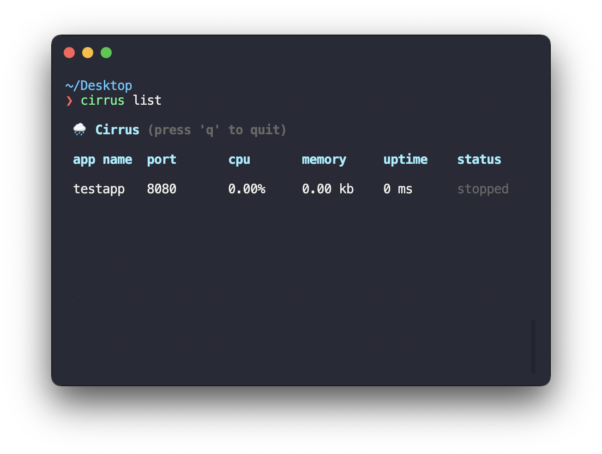

<h1 align="center" style="font-weight: bold">🌧 Cirrus</h1>

<div align="center">

Cirrus is a push to deploy tool written above the cirrus clouds. Inspired by Evan You's pod.

[](https://github.com/skoshx/cirrus/blob/main/LICENSE.md)
[](https://github.com/skoshx/cirrus/actions/workflows/ci.yml)
[](https://github.com/prettier/prettier)
<br />
[](https://github.com/facebook/jest)
[](https://github.com/skoshx/cirrus/blob/main/CONTRIBUTING.md#pull-requests)

</div>

<p align="center">

</p>

## Install

```bash
$ yarn global add cirrus
```

## Usage

**TODO: Write usage docs**

## Docs

**TODO: Write docs**

## Contributing

All contributions are welcome! Please read below for guidelines on how to get started.

#### Feature request

If you want to propose a new feature, open an issue.

#### Found a bug?

1. [Fork](https://help.github.com/articles/fork-a-repo/) this repository to your own GitHub account and then [clone](https://help.github.com/articles/cloning-a-repository/) it to your local device
2. Link the package to the global module directory: `npm link`
3. Within the module you want to test your local development instance of `cirrus`, just link it to the dependencies: `npm link cirrus`. Node.js will now use your local clone of `cirrus`!

## License

Cirrus is released under the [MIT License](https://opensource.org/licenses/MIT).

## TODO

- Tests
- Plugins
- Automatic Caddy server configuration
- Automatic Postgres configuration
